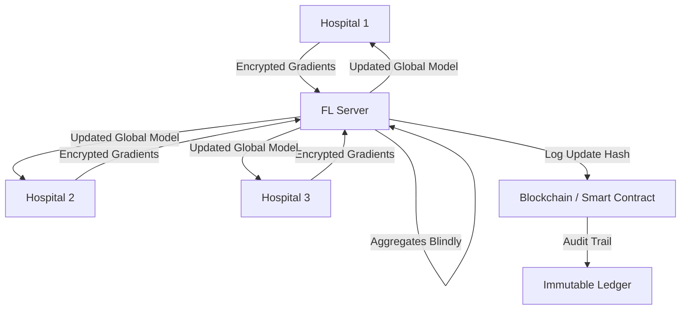

# 🏥 MediChain-FL: The Secret Agent of Medical AI 🕵️‍♂️

**Privacy-Preserving Federated Learning for Medical Imaging**
*Federated Learning + Homomorphic Encryption + Blockchain = Secure Collaboration*

---

## 🚀 What is this?

Imagine hospitals collaborating to build a super-intelligent AI for pneumonia detection **without ever sharing a single patient X-ray**.

**MediChain-FL** makes this possible. It combines:
1.  **Federated Learning (Flower):** Hospitals train models locally and share only "math" (gradients), not data.
2.  **Homomorphic Encryption (CKKS):** These gradients are encrypted so the server aggregates them **blindfolded**. It never sees the raw updates.
3.  **Blockchain (Hardhat/Ethereum):** Every training round is logged on an immutable ledger for a complete, tamper-proof audit trail.

**The Result:** 93% accuracy in pneumonia detection while keeping HIPAA/GDPR fully satisfied.

---

## 🏗 Architecture



---

## 🛠 Tech Stack

-   **Deep Learning:** PyTorch, UNet/ResNet (Transfer Learning)
-   **Federated Learning:** Flower (Flwr)
-   **Privacy:** TenSEAL (CKKS Homomorphic Encryption)
-   **Blockchain:** Hardhat, Solidity, Ethers.js
-   **Language:** Python 3.10+, Node.js 20+

---

## ⚙️ Setup Instructions

### Prerequisites
*   Python 3.10+
*   Node.js 20+ (LTS)
*   Git

### 1. Installation

```bash
# Clone the repository
git clone https://github.com/Amitesh-AJ10/MediChain-FL.git
cd MediChain-FL

# 🐍 Backend Setup (Python)
# We use 'uv' or 'pip'. If you have uv: uv pip install -r requirements.txt
python3.10 -m venv venv
source venv/bin/activate  # Windows: venv\Scripts\activate
pip install -r requirements.txt

# ⛓️ Blockchain Setup (Node.js)
npm install
```

### 2. Dataset Setup
You need the NIH Chest X-ray dataset.
```bash
# Authenticate with Kaggle API first
# Ensure kaggle.json is in ~/.kaggle/

kaggle datasets download -d paultimothymooney/chest-xray-pneumonia
unzip chest-xray-pneumonia.zip -d ./data/
```
*Structure should look like: `data/chest_xray/train/...`*

**Split Data for Hospitals:**
Run the helper script to simulate multiple hospitals:
```bash
python scripts/prepare_hospital_data.py
```
This will create `data/hospital_1`, `data/hospital_2`, etc.

---

## 🎬 How to Run

You will need **multiple terminal windows**.

### Terminal 1: Start the Blockchain Network
```bash
cd blockchain
npx hardhat node
```

### Terminal 2: Deploy Smart Contract
```bash
cd blockchain
npx hardhat run scripts/deploy_proxy.js --network localhost
```

### Terminal 3: Start the Federated Learning Server
```bash
# Make sure venv is active and you are in the root directory
source venv/bin/activate
python backend/fl_client/server.py
```

### Terminal 4, 5, 6: Start Hospital Clients
Open a new terminal for each hospital, activate venv, and run:

**Hospital 1:**
```bash
python backend/fl_client/client.py --hospital-id hospital_1
```

**Hospital 2:**
```bash
python backend/fl_client/client.py --hospital-id hospital_2
```

**Hospital 3 (Optional):**
```bash
python backend/fl_client/client.py --hospital-id hospital_3
```

Watch the magic happen! The server will aggregate encrypted updates, and you'll see transaction hashes logged in Terminal 1 (Blockchain).

---

## 🔮 Future Roadmap

- [ ] **Asynchronous FL:** Handle hospitals with different compute speeds.
- [ ] **Differential Privacy:** Add noise to gradients for an extra layer of security.
- [ ] **Real-world Integration:** FHIR standard support for hospital EHR systems.
- [ ] **Dashboard:** React frontend for real-time visualization of training and blockchain events.

---

## 📜 License

MIT License. Built for the Hackathon by Team MediChain.
